<h1 align="center">Hi, I'm Aditya Tiwari 👋</h1>
<h3 align="center">QA Automation Engineer transitioning into Data Analytics</h3>

<p align="center">
Mumbai, India &nbsp;•&nbsp;
<a href="https://www.linkedin.com/in/aditya-tiwari-601306174/">LinkedIn</a> &nbsp;•&nbsp;
<a href="https://adityatiwaricodes.github.io/">Portfolio</a>
</p>

<p align="center">
<a href="#about-me">About</a> •
<a href="#tech-stack">Skills</a> •
<a href="#professional-experience">Experience</a> •
<a href="#featured-projects">Projects</a> •
<a href="#certifications">Certifications</a> •
<a href="#github-stats">GitHub</a> •
<a href="#lets-connect">Contact</a>
</p>

---

### About Me

- 🔍 3+ years testing production **financial and billing systems** — Selenium/Java, BDD Cucumber, REST API automation, on an enterprise billing & finance platform (React/Angular front end)
- 📊 Extending that QA rigor into **data analytics** — SQL-based validation, defect-trend analysis, and KPI reporting are already part of my day job; I've taken it further with self-driven projects in Power BI, Python, and Tableau
- 🎓 Currently completing an **MCA at Jain University** (CGPA 9.30/10)
- 🎯 Looking for **Data Analyst / BI Analyst / Reporting Analyst** roles (also open to QA Automation roles) in fintech, BFSI, and high-growth startups
- ⚡ Comfortable end-to-end with data: cleaning → validation → visualization → stakeholder reporting

**Professional Snapshot**

```
💼 Experience        →  3+ Years
🧪 Specialization     →  QA Automation → Data Analytics
🐍 Core Languages     →  Python, Java, SQL
🧰 Automation         →  Selenium, Playwright, BDD Cucumber
📊 Analytics          →  Power BI, Tableau, Pandas/NumPy
🏢 Domain             →  FinTech / Enterprise Billing
```

---

### Tech Stack

**Languages**


**Analytics & Visualization**


**Databases**


**Testing & Automation**


**DevOps & Tools**


<details>
<summary>🔎 View Automation Engineering Details</summary>

- **UI Automation:** Selenium WebDriver (Java), Page Object Model
- **API Testing:** REST API validation, Postman, JSON/XML, HTTP methods
- **BDD:** Cucumber, Gherkin-style scenario design
- **CI/CD:** Jenkins pipelines, GitHub Actions
- **Data-driven & regression testing:** parameterized test suites across billing/finance workflows
- **Reporting:** Extent Reports, Log4j2 logging, Excel-based KPI dashboards

</details>

---

### Professional Experience

```
Feb 2023 — Present
└── Software QA Automation Engineer
    └── DataDevice, Mumbai
        Enterprise billing & finance platform (web + REST API, React/Angular)
```

- Built and maintained weekly KPI and defect-trend dashboards in Excel across 3 product lines, aggregating test execution, coverage, and pass/fail data to enable data-driven release decisions
- Ran root-cause and trend analysis on 200+ production defects using SQL against production/staging datasets, reducing recurring defects by 15%
- Analyzed test execution data to surface 40+ untested edge cases, expanding coverage from 75% to 95%
- Streamlined QA workflows and reporting to cut manual cycle time by 25%
- Built a Selenium/Java/BDD Cucumber automation framework and REST API test suites for invoice generation, payment processing, and financial reconciliation — 150+ test cases, 90%+ regression coverage

---

### Featured Projects

**[Sales Performance Dashboard](https://github.com/AdityaTiwariCodes/sales-analysis-dashboard)**
8-page interactive Power BI dashboard analyzing regional sales KPIs across 50,000+ records — advanced DAX (YoY growth, running totals, regional variance), drill-through navigation. Cut manual reporting time from 3 days to under 1 hour.
`Power BI` `DAX`

**[FinPulse — Real-Time Market Intelligence Dashboard](https://github.com/AdityaTiwariCodes/finpulse-zorvyn)**
Live fintech analytics dashboard with technical indicators (Bollinger Bands, RSI) and correlation analysis. Concurrent API calls + TTL caching cut API load by ~80% and eliminated UI lag.
`Python` `Pandas` `NumPy` `Plotly` `Streamlit` `REST APIs`

**[HR Database Management System](https://github.com/AdityaTiwariCodes/HR-Database-Management-System-Using-SQL)**
Normalized (3NF) relational database for 500+ employee records across 5 related tables, with stored procedures and indexed joins — 40% faster queries vs. a flat-file baseline.
`SQL` `MySQL`

**[Hybrid Test Automation Framework — Opencart](https://github.com/AdityaTiwariCodes/OpencartV1.0)**
Hybrid automation framework with Dockerized Selenium Grid for parallel cross-browser testing, integrated with Jenkins CI/CD, Log4j2 logging, and Extent Reports.
`Java` `Selenium` `TestNG` `Cucumber` `Docker` `Jenkins`

<details>
<summary>🏗️ View framework architecture</summary>

```
Test Cases
    ↓
TestNG
    ↓
Cucumber (BDD)
    ↓
Selenium WebDriver
    ↓
Dockerized Selenium Grid (parallel, cross-browser)
    ↓
Opencart Application
    ↓
Jenkins CI/CD → Extent Reports + Log4j2
```

</details>

---

### Currently Learning

📚 AI/LLM applications for software testing and data analytics

---

### Certifications

<details>
<summary>📜 View all certifications</summary>

- Data Analytics Job Simulation — Deloitte Australia (Forage)
- Power BI for Data Analysts by Microsoft Press — LinkedIn / Simplilearn
- Career Essentials in Data Analysis — Microsoft / LinkedIn
- Software Testing Foundations: Manual to Automation, Agile Testing — LinkedIn Learning
- Build Your Generative AI Productivity Skills — Microsoft / LinkedIn
- Introducing Postman — LinkedIn Learning

</details>

---

### GitHub Stats

<p align="center">


</p>

---

### Let's Connect

I'm always interested in discussing test automation, data analytics, SQL, Python, and quality engineering.

<p align="center">
📫 <a href="https://www.linkedin.com/in/aditya-tiwari-601306174/">LinkedIn</a> &nbsp;•&nbsp;
🌐 <a href="https://adityatiwaricodes.github.io/">Portfolio</a>
</p>
